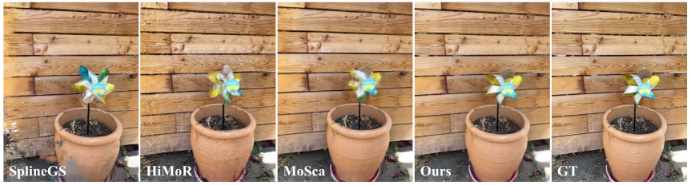
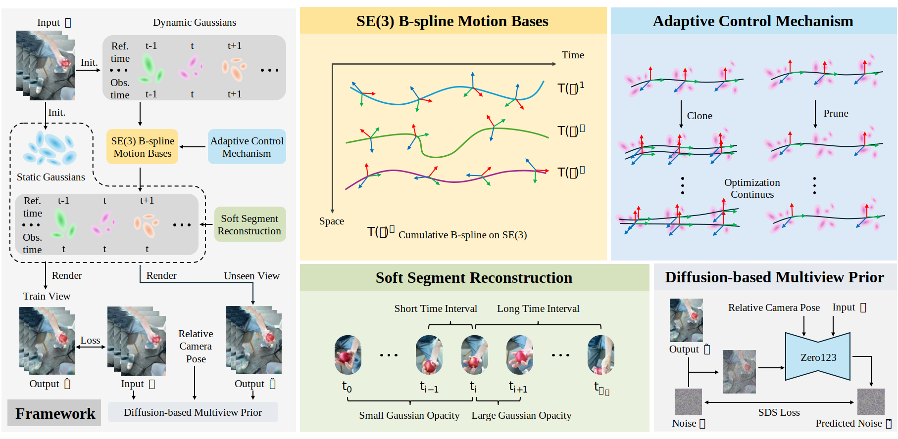

# Dynamic Gaussian Splatting from Defocused and Motion-blurred Monocular Videos (CVPR 2026)

Xuankai Zhang, Junjin Xiao, Shangwei Huang, Wei-shi Zheng, and Qing Zhang

<!-- project page and paper -->
<!-- [Project Page](https://dydeblur.github.io/) &nbsp; [Paper](https://arxiv.org/abs/2510.10691)  -->

<!-- pageviews -->
<!-- <a href="https://info.flagcounter.com/dhPB"></a> -->

<!-- teaser -->



Our method synthesizes high-quality novel views from monocular videos.


## Method Overview


<!-- Our method's overall workflow. Dotted arrows and dashed arrows describe the pipeline for modeling camera motion blur and modeling defocus blur, respectively at training time. Solid arrows show the process of rendering sharp images at the inference time. Please refer to the paper for more details. -->

## Todo
<!-- - [ ] ~~Release Paper, Example Code~~ -->
- [ ] Release Paper
- [ ] Release Code
- [ ] Clean Code

<!-- ## Setup
###  1. Installation
```
git clone https://github.com/hhhddddddd/dydeblur.git --recursive 
cd dydeblur

conda create -n dydeblur python=3.10
conda activate dydeblur

# install pytorch
conda install pytorch==2.5.0 torchvision==0.20.0 torchaudio==2.5.0 pytorch-cuda=12.4 -c pytorch -c nvidia -y

# install dependencies
pip install -r requirements.txt
```

### 2. Training
```
python train.py -s <dataset> -m <output> -o <expname> -c 0.01 --eval --iterations 40000
```

### 3. Evaluation
```
python render.py -m <output> -o <expname> -c 0.01 -t <time> --mode render 
```
<!--  -->


 
